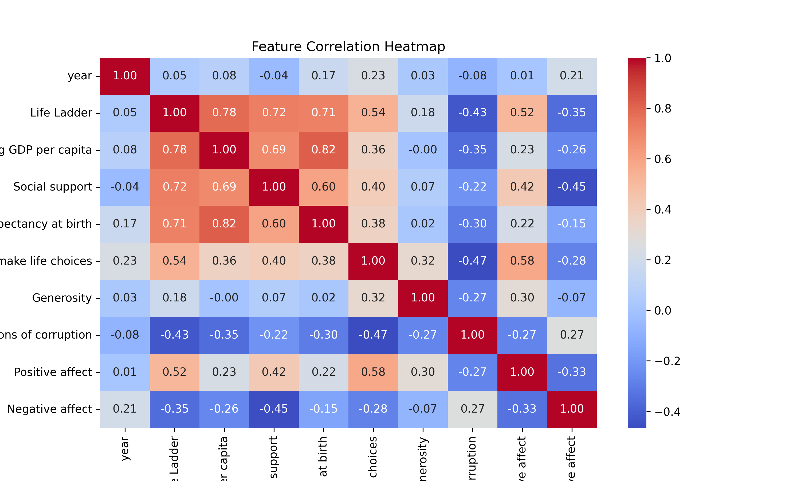

# Automated Data Analysis Report

## Dataset: happiness.csv

### Summary Statistics

|        | Country name   |       year |   Life Ladder |   Log GDP per capita |   Social support |   Healthy life expectancy at birth |   Freedom to make life choices |     Generosity |   Perceptions of corruption |   Positive affect |   Negative affect |
|:-------|:---------------|-----------:|--------------:|---------------------:|-----------------:|-----------------------------------:|-------------------------------:|---------------:|----------------------------:|------------------:|------------------:|
| count  | 2363           | 2363       |    2363       |           2335       |      2350        |                         2300       |                    2327        | 2282           |                 2238        |       2339        |      2347         |
| unique | 165            |  nan       |     nan       |            nan       |       nan        |                          nan       |                     nan        |  nan           |                  nan        |        nan        |       nan         |
| top    | Argentina      |  nan       |     nan       |            nan       |       nan        |                          nan       |                     nan        |  nan           |                  nan        |        nan        |       nan         |
| freq   | 18             |  nan       |     nan       |            nan       |       nan        |                          nan       |                     nan        |  nan           |                  nan        |        nan        |       nan         |
| mean   | nan            | 2014.76    |       5.48357 |              9.39967 |         0.809369 |                           63.4018  |                       0.750282 |    9.77213e-05 |                    0.743971 |          0.651882 |         0.273151  |
| std    | nan            |    5.05944 |       1.12552 |              1.15207 |         0.121212 |                            6.84264 |                       0.139357 |    0.161388    |                    0.184865 |          0.10624  |         0.0871311 |
| min    | nan            | 2005       |       1.281   |              5.527   |         0.228    |                            6.72    |                       0.228    |   -0.34        |                    0.035    |          0.179    |         0.083     |
| 25%    | nan            | 2011       |       4.647   |              8.5065  |         0.744    |                           59.195   |                       0.661    |   -0.112       |                    0.687    |          0.572    |         0.209     |
| 50%    | nan            | 2015       |       5.449   |              9.503   |         0.8345   |                           65.1     |                       0.771    |   -0.022       |                    0.7985   |          0.663    |         0.262     |
| 75%    | nan            | 2019       |       6.3235  |             10.3925  |         0.904    |                           68.5525  |                       0.862    |    0.09375     |                    0.86775  |          0.737    |         0.326     |
| max    | nan            | 2023       |       8.019   |             11.676   |         0.987    |                           74.6     |                       0.985    |    0.7         |                    0.983    |          0.884    |         0.705     |

### Missing Values

|                                  |   0 |
|:---------------------------------|----:|
| Country name                     |   0 |
| year                             |   0 |
| Life Ladder                      |   0 |
| Log GDP per capita               |  28 |
| Social support                   |  13 |
| Healthy life expectancy at birth |  63 |
| Freedom to make life choices     |  36 |
| Generosity                       |  81 |
| Perceptions of corruption        | 125 |
| Positive affect                  |  24 |
| Negative affect                  |  16 |

### Correlation Matrix

|                                  |       year |   Life Ladder |   Log GDP per capita |   Social support |   Healthy life expectancy at birth |   Freedom to make life choices |   Generosity |   Perceptions of corruption |   Positive affect |   Negative affect |
|:---------------------------------|-----------:|--------------:|---------------------:|-----------------:|-----------------------------------:|-------------------------------:|-------------:|----------------------------:|------------------:|------------------:|
| year                             |  1         |     0.0468461 |          0.0801038   |       -0.0430737 |                          0.168026  |                       0.232974 |  0.0308644   |                  -0.0821355 |         0.0130525 |         0.207642  |
| Life Ladder                      |  0.0468461 |     1         |          0.783556    |        0.722738  |                          0.714927  |                       0.53821  |  0.177398    |                  -0.430485  |         0.515283  |        -0.352412  |
| Log GDP per capita               |  0.0801038 |     0.783556  |          1           |        0.685329  |                          0.819326  |                       0.364816 | -0.000765985 |                  -0.353893  |         0.230868  |        -0.260689  |
| Social support                   | -0.0430737 |     0.722738  |          0.685329    |        1         |                          0.597787  |                       0.404131 |  0.0652399   |                  -0.22141   |         0.424524  |        -0.454878  |
| Healthy life expectancy at birth |  0.168026  |     0.714927  |          0.819326    |        0.597787  |                          1         |                       0.375745 |  0.0151682   |                  -0.30313   |         0.217982  |        -0.15033   |
| Freedom to make life choices     |  0.232974  |     0.53821   |          0.364816    |        0.404131  |                          0.375745  |                       1        |  0.321396    |                  -0.466023  |         0.578398  |        -0.278959  |
| Generosity                       |  0.0308644 |     0.177398  |         -0.000765985 |        0.0652399 |                          0.0151682 |                       0.321396 |  1           |                  -0.270004  |         0.300608  |        -0.0719746 |
| Perceptions of corruption        | -0.0821355 |    -0.430485  |         -0.353893    |       -0.22141   |                         -0.30313   |                      -0.466023 | -0.270004    |                   1         |        -0.274208  |         0.265555  |
| Positive affect                  |  0.0130525 |     0.515283  |          0.230868    |        0.424524  |                          0.217982  |                       0.578398 |  0.300608    |                  -0.274208  |         1         |        -0.334451  |
| Negative affect                  |  0.207642  |    -0.352412  |         -0.260689    |       -0.454878  |                         -0.15033   |                      -0.278959 | -0.0719746   |                   0.265555  |        -0.334451  |         1         |

### AI-Generated Insights

### Data Story: Understanding Global Well-Being Through the Life Ladder Dataset

#### Overview
The dataset consists of 2,363 observations across 165 countries spanning from 2005 to 2023. It captures various dimensions of well-being, measured through factors such as Life Ladder (subjective well-being), Log GDP per capita, Social support, Healthy life expectancy, and more.

#### Summary Statistics
- **Life Ladder** scores, indicating overall life satisfaction, average around 5.48, with a maximum score of 8.02. This suggests a generally moderate perception of well-being among populations.
- **Log GDP per capita** has a mean of 9.40, indicating variations in economic prosperity, with some countries reporting significantly higher figures.
- **Social support**, averaged at 0.81, highlights the importance of community and relationships in individual well-being.
- The data also shows variability in perceptions of freedom, generosity, and affective states, suggesting diverse societal contexts affecting individual experiences.

#### Missing Data Insights
- Missing data is present in several key metrics, particularly in **Generosity (81 missing)** and **Perceptions of corruption (125 missing)**. The severity of missing values in generosity may indicate challenges in measuring altruistic behaviors across nations.
- The substantial missing data for **Healthy life expectancy at birth (63 missing)** suggests potential weaknesses in health data collection in certain countries, possibly impacting health-centric policies.

#### Correlation Insights
The correlation matrix reveals critical relationships:
- **Log GDP per capita and Life Ladder**: A strong positive correlation (0.78) indicates that wealthier nations typically report higher life satisfaction.
- **Social support, Healthy life expectancy, and Life Ladder** also show strong correlations ranging from 0.71 to 0.72, emphasizing the role of support systems and health in enhancing subjective well-being.
- Notably, **Freedom to make life choices** displays a robust positive relationship (0.54) with Life Ladder, underscoring how individual autonomy can significantly impact someone's sense of happiness.
  
Conversely, there is a negative correlation between **Perceptions of corruption and Life Ladder (-0.43)**, hinting that citizens in more corrupt environments often experience lower satisfaction in their lives.

#### Notable Trends
- Over time, from 2005 to 2023, the average life satisfaction (Life Ladder) has shown moderate increases, a potential positive outcome reflecting improvements in various societal dimensions.
- Countries that prioritize social support and health measures have achieved better well-being scores, suggesting a multifaceted approach to improving quality of life is essential.
  
### Implications
1. **Policy Focus**: Governments should prioritize improving GDP while ensuring that economic growth translates into tangible benefits for well-being, such as health care and social services.
2. **Community Programs**: Investment in social support networks can improve overall life satisfaction, especially in developing countries where social frameworks may be weaker.
3. **Corruption Mitigation**: Reducing corruption through transparency initiatives could significantly enhance citizen satisfaction, indicating a direction for governance reform.
4. **Healthcare Access**: As healthy life expectancy impacts well-being, expanding healthcare access to ensure longevity and quality of life could foster a more satisfied populace.

By recognizing these insights and implications, policymakers and community leaders can tailor their approaches to enhance the quality of life and well-being on a global scale.

### Visualizations

