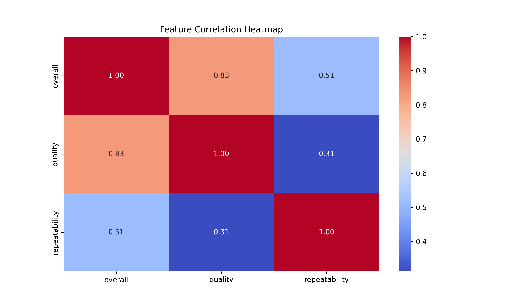

# Automated Data Analysis Report

## Dataset: media.csv

### Summary Statistics

|        | date      | language   | type   | title             | by                |    overall |     quality |   repeatability |
|:-------|:----------|:-----------|:-------|:------------------|:------------------|-----------:|------------:|----------------:|
| count  | 2553      | 2652       | 2652   | 2652              | 2390              | 2652       | 2652        |     2652        |
| unique | 2055      | 11         | 8      | 2312              | 1528              |  nan       |  nan        |      nan        |
| top    | 21-May-06 | English    | movie  | Kanda Naal Mudhal | Kiefer Sutherland |  nan       |  nan        |      nan        |
| freq   | 8         | 1306       | 2211   | 9                 | 48                |  nan       |  nan        |      nan        |
| mean   | nan       | nan        | nan    | nan               | nan               |    3.04751 |    3.20928  |        1.49472  |
| std    | nan       | nan        | nan    | nan               | nan               |    0.76218 |    0.796743 |        0.598289 |
| min    | nan       | nan        | nan    | nan               | nan               |    1       |    1        |        1        |
| 25%    | nan       | nan        | nan    | nan               | nan               |    3       |    3        |        1        |
| 50%    | nan       | nan        | nan    | nan               | nan               |    3       |    3        |        1        |
| 75%    | nan       | nan        | nan    | nan               | nan               |    3       |    4        |        2        |
| max    | nan       | nan        | nan    | nan               | nan               |    5       |    5        |        3        |

### Missing Values

|               |   0 |
|:--------------|----:|
| date          |  99 |
| language      |   0 |
| type          |   0 |
| title         |   0 |
| by            | 262 |
| overall       |   0 |
| quality       |   0 |
| repeatability |   0 |

### Correlation Matrix

|               |   overall |   quality |   repeatability |
|:--------------|----------:|----------:|----------------:|
| overall       |  1        |  0.825935 |        0.5126   |
| quality       |  0.825935 |  1        |        0.312127 |
| repeatability |  0.5126   |  0.312127 |        1        |

### AI-Generated Insights

**Data Analysis Summary: Insights and Implications**

This dataset comprises 2,652 entries, predominantly featuring information about movies, with notable characteristics and interesting trends worth exploring. 

### Key Insights:

1. **Temporal Coverage**: 
   - The dataset includes films with a diverse release timeline, with the most common date indicating a frequency of 8 occurrences concentrated around May 21, 2006. However, there's a void of contiguous temporal data that complicates thorough longitudinal analysis. 
   - There are 99 missing values for dates, suggesting a need to fill in these gaps for enhanced temporal insights.

2. **Language Diversity**: 
   - Featuring 11 unique languages, with English being the most frequent (1,306 occurrences), the dataset showcases a predominance of English-language films. This may reflect broader cultural consumption patterns or the sourcing methods of the dataset.

3. **Film Types**: 
   - With 8 distinct types, movies notably dominate the frequency distribution (2,211 occurrences). This concentration might indicate curated content around popular cinematic forms, potentially overlooking other valuable media types.

4. **Quality and Ratings**:
   - The average ratings indicate generally favorable assessments, with an overall mean score of approximately 3.05, a quality score of 3.21, and repeatability rated at 1.49. 
   - Notably, the ratings are clustered with standard deviations suggesting moderate variability, as the majority are close to the mean.

5. **Correlation Dynamics**:
   - The correlation matrix reveals significant relationships:
     - A strong positive correlation (0.83) between overall ratings and quality suggests that higher perceived quality is synonymous with superior overall ratings.
     - A moderate correlation (0.51) between overall ratings and repeatability indicates that films rated higher in overall enjoyment also tend to be perceived as more repeatable.

6. **Missing Values**:
   - There are significant missing values in the 'by' column (262), suggesting a notable lack of information about the contributors or directors involved in many entries, which may impact the richness of contextual data.

### Trends and Notable Characteristics:

- **Popularity and Critical Reception**: The dataset seems reflective of popular titles and those appreciated by audiences, highlighted through ratings that cluster towards the higher end of the scale.
  
- **Potential Bias in Representation**: The heavy tilt towards English-language films and the omission of various directors might introduce bias, indicating that a broader dataset could provide a more holistic view of global cinema.

### Implications and Recommendations:

- **Data Quality Improvement**: Addressing the missing values, especially for dates and contributor information, would enhance analysis and insights significantly. Filling these gaps could lead to more rigorous longitudinal studies and insights into newer trends.
  
- **Diversity in Content Typology**: Further expanding the dataset to include more varied types of media or less prevalent languages would offer a more comprehensive overview of global film distribution and reception.

- **Exploring Correlations Deeper**: Harness the existing correlations to investigate which specific factors influence ratings. Further analysis could entail regression modeling to predict ratings based on quality and repeatability, providing empirical insights that could be beneficial for filmmakers and marketers.

Overall, while this dataset offers a solid foundation for understanding aspects of film ratings and characteristics, expanding its scope and rectifying its missing elements could unveil a wealth of insights and trends. Ensuring a more diverse and representative dataset might yield richer analyses, beneficial for stakeholders within the film industry.

### Visualizations

